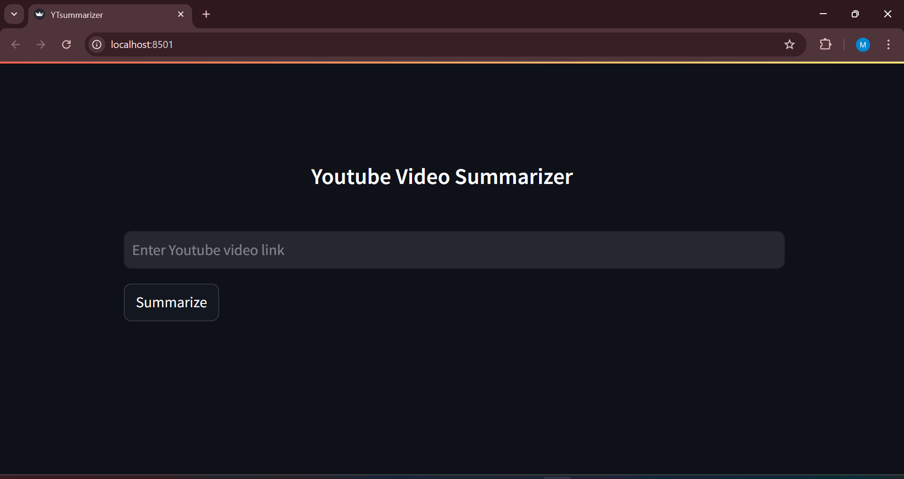
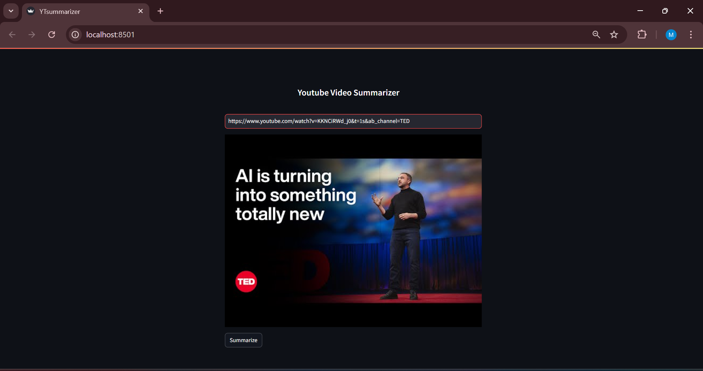
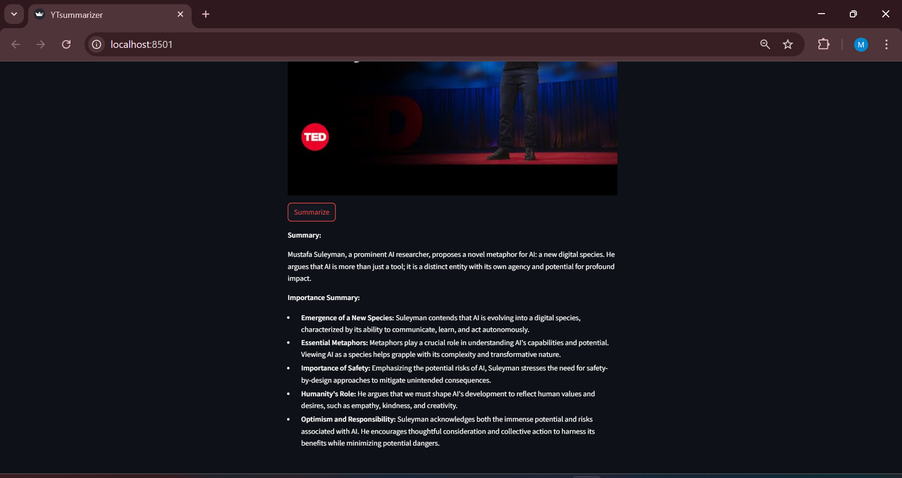

# YouTube Video Summarizer

YouTube Video Summarizer is a web application built with Streamlit that allows users to extract and summarize transcripts of YouTube videos. The app leverages Google's Gemini Pro model to generate concise summaries based on the video's transcript.






## Features

- **Extract Transcript**: Fetches the transcript of a YouTube video using its URL.
- **Generate Summary**: Summarizes the video transcript into key points, limited to 250 words, using the Gemini Pro model.
- **User-Friendly Interface**: Input a YouTube link, view the video thumbnail, and get a summary with a click.

## Installation

### Prerequisites

- Python 3.7 or higher
- Google API key for Generative AI (Gemini Pro model)
- pip (Python package installer)

### Steps to Install

1. **Clone the Repository**

    ```bash
    git clone https://github.com/your-username/YTsummarizer.git
    cd YTsummarizer
    ```

2. **Install Required Packages**

    ```bash
    pip install -r requirements.txt
    ```

3. **Set Up Environment Variables**

    - Create a `.env` file in the project root directory.
    - Add your Google API key to the `.env` file:

    ```env
    GOOGLE_API_KEY=your_google_api_key_here
    ```

## Usage

1. **Run the Streamlit App**

    ```bash
    streamlit run app.py
    ```

2. **Interact with the Application**

    - Enter a YouTube video link.
    - Click "Summarize" to generate the summary.
    - View the summarized content.

## Project Structure

```plaintext
YTsummarizer/
├── app.py               # Main application file
├── requirements.txt     # Dependencies for the project
├── .env                 # Environment variables (not included in the repository)
├── README.md            # Project documentation
```

## Dependencies

- `streamlit`: Used for building the web app interface.
- `youtube_transcript_api`: To fetch transcripts from YouTube videos.
- `google-generativeai`: For accessing and using the Gemini Pro model.
- `python-dotenv`: For managing environment variables.

## License

This project is licensed under the MIT License.


## Author

**Abdullah Al Mazed**

For any questions or inquiries, you can reach me at [almazed9@gmail.com](mailto:your-email@example.com).
